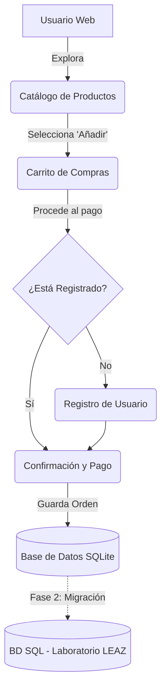

# Diseño y Arquitectura: MLtips

## 1. Arquitectura de la Prueba de Concepto (POC)
La aplicación sigue un patrón de diseño Modelo-Vista-Controlador (MVC) simplificado, soportado por Flask:
*   **Modelo:** Define la estructura de datos usando SQLAlchemy ORM.
*   **Vista:** Plantillas HTML renderizadas en el servidor usando Jinja2.
*   **Controlador:** Rutas de Flask que manejan la lógica de negocio y las peticiones del usuario.

## 2. Diagrama de Flujo Conceptual

## 3. Esquema de Datos Relacional

*   **User (Usuario)**
    *   `id` (Integer, Primary Key)
    *   `nombre` (String)
    *   `email` (String, Unique)
    *   `direccion` (String)
    *   `fecha_registro` (DateTime)

*   **Product (Producto)**
    *   `id` (Integer, Primary Key)
    *   `nombre` (String) - (Ej: Shampoo, Acondicionador)
    *   `descripcion` (Text)
    *   `precio` (Float)
    *   `imagen_url` (String)

*   **Order (Orden de Compra)**
    *   `id` (Integer, Primary Key)
    *   `user_id` (Integer, Foreign Key -> User.id)
    *   `total` (Float)
    *   `estado` (String) - (Pendiente, Pagado)
    *   `fecha_creacion` (DateTime)

*   **OrderItem (Detalle de Orden)**
    *   `id` (Integer, Primary Key)
    *   `order_id` (Integer, Foreign Key -> Order.id)
    *   `product_id` (Integer, Foreign Key -> Product.id)
    *   `cantidad` (Integer)
    *   `precio_unitario` (Float)

## 4. Diseño Visual y UI/UX
La interfaz busca transmitir cuidado, belleza y feminidad, utilizando una paleta de colores suaves.

*   **Color Principal:** Palo de Rosa (`#D8A7A7`) - Usado en botones principales, encabezados y elementos destacados.
*   **Colores de Acento/Contraste:**
    *   Verde Suave (`#B3C9B5`): Éxito, confirmaciones, precios.
    *   Azul Suave (`#AEC6CF`): Botones secundarios, enlaces informativos.
    *   Naranja Suave (`#F4C2A3`): Alertas sutiles, promociones o llamadas a la acción (CTA) secundarias.
*   **Color de Fondo:** Blanco crema (`#FDFBFB`) para mantener la limpieza visual y resaltar la paleta.
*   **Texto:** Gris oscuro (`#4A4A4A`) para garantizar una buena legibilidad.
